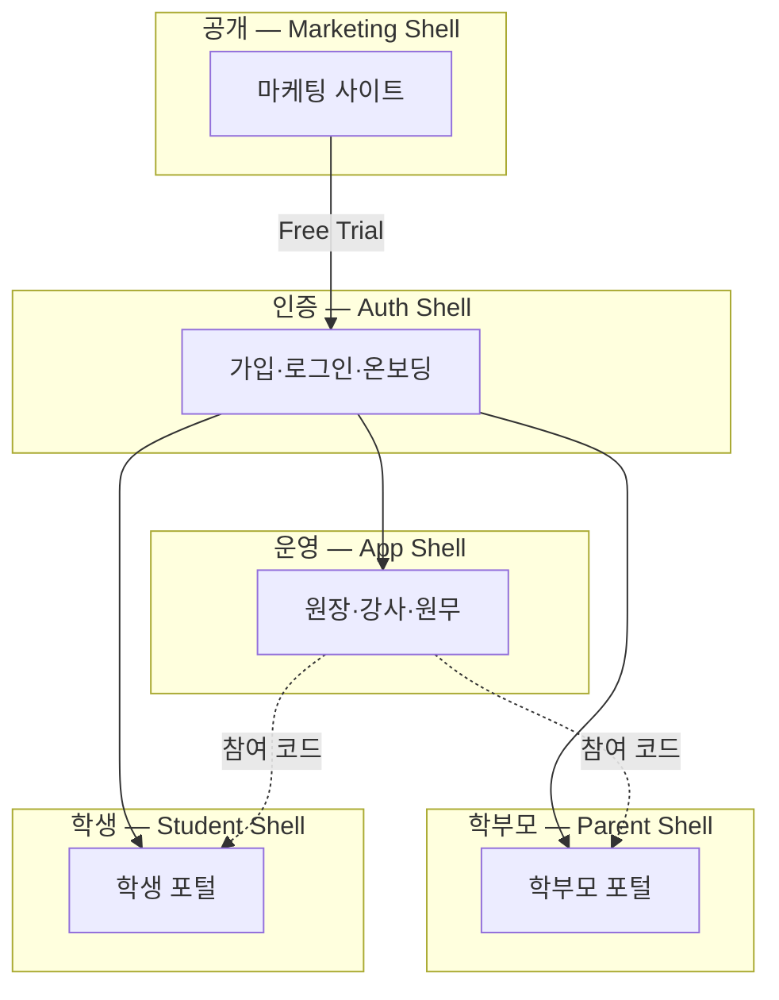
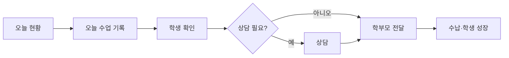
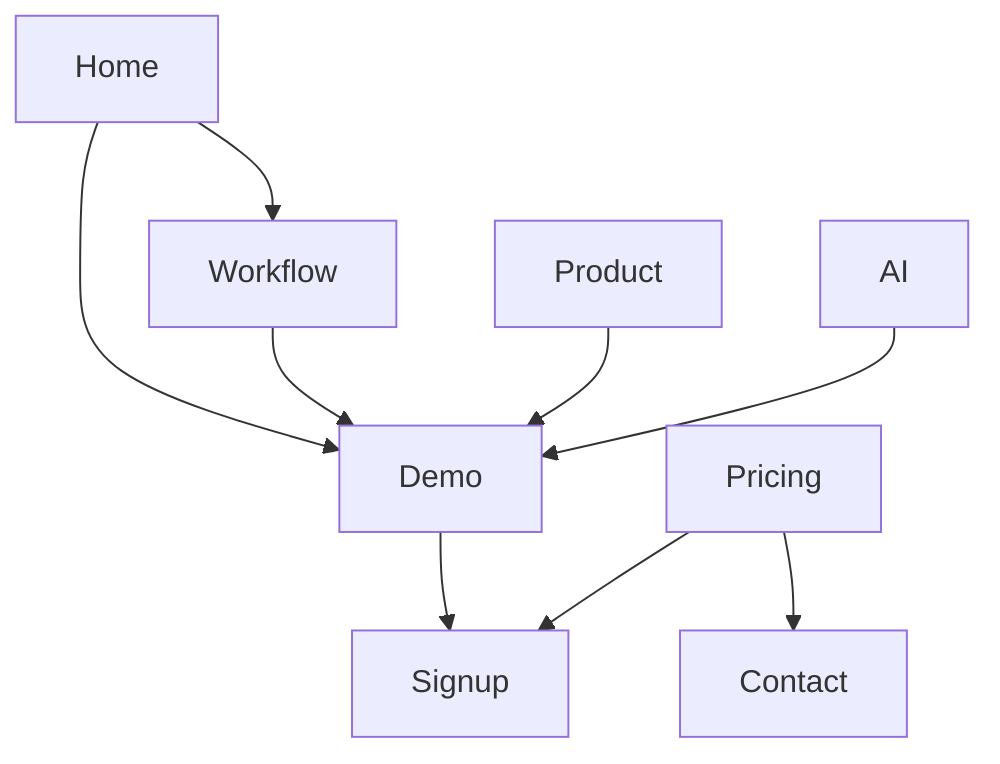
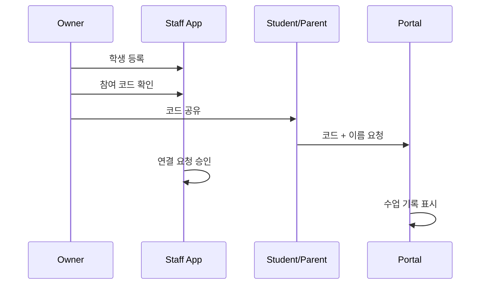

# EduFlow Information Architecture (전면 재설계)

> **범위:** 정보 구조·네비게이션·라벨·진입 경로·콘텐츠 계층만 정의합니다.  
> **비범위:** 기능 추가·삭제·API·DB·화면 로직 변경 (기존 라우트·기능 100% 유지).

**버전:** 2026-05 · **상태:** 설계안 (구현 전 참조 문서)

---

## 0. 한 줄 정의

**EduFlow는 「수업 기록 → 학생 이해 → 상담 → 학부모 소통 → 재등록」이 끊기지 않는 AI 학원 운영 OS입니다.**

IA의 모든 결정은 이 **운영 루프**를 따라야 합니다. 기능 목록이 아니라 **업무 순서**가 골격입니다.

---

## 1. IA 설계 원칙

| # | 원칙 | 의미 |
|---|------|------|
| 1 | **루프 우선** | 메뉴는 ERP 모듈이 아니라 「오늘 → 수업 → 학생 → 상담 → 소통 → 운영」 순 |
| 2 | **입력 1곳, 조회 N곳** | 출결·숙제·점수 **입력**은 `오늘 수업` 중심. 개별 화면은 **조회·보정** |
| 3 | **학생 = 허브** | 학생 상세가 모든 신호·상담·리포트의 수렴점 |
| 4 | **1 화면 1 CTA** | 각 화면의 주 행동은 하나. 나머지는 보조 링크 |
| 5 | **역할별 Shell 분리** | Staff / Parent / Student / Marketing / Auth — 네비 공유 금지 |
| 6 | **중립 언어** | 학생·학부모-facing: 「위험」「주의」「재등록 관리」 금지 → 「상담 권장」「학생 성장」 |
| 7 | **설정은 분산 허용** | ADR-008: 연동·알림·권한은 해당 업무 맥락 + 설정 허브 |
| 8 | **딥링크 보존** | 사이드바에서 숨겨도 URL·북마크·알림 링크는 유효 |

---

## 2. 시스템 지도 (5개 표면)



| Shell | 기본 홈 | 대상 | IA 목표 |
|-------|---------|------|---------|
| Marketing | `/` | 비로그인 방문자 | 5초 내 가치 이해 → Demo/Signup |
| Auth | `/login`, `/onboarding` | 신규·복귀 사용자 | 역할 선택 → 최소 프로필 → 학원/자녀 연결 |
| Staff | `/dashboard` | owner, teacher, desk | 오늘 업무 완료 |
| Parent | `/parent` | parent | 자녀 학습·상담·납부 확인 |
| Student | `/student` | student | 내 수업·숙제·일정 확인 |

---

## 3. 핵심 User Flow (Staff)



**아침:** Dashboard → 할 일 → 시간표  
**수업 후:** 오늘 수업 → (이슈 학생) 학생 상세  
**상담:** 상담센터 또는 학생 상세 → 상담 카드 → 학부모 전달  
**주기:** 수납 · 학생 성장 · 운영 분석

---

## 4. Staff App IA (재설계)

### 4.1 1차 네비게이션 (사이드바 — 6그룹)

사이드바 항목은 **최대 6개 그룹 + 설정**. 그룹당 1~4개 2차 항목.

```
① 오늘          → /dashboard
② 수업          → 오늘 수업, 시간표, 진도
③ 학생          → 학생, 반·연결
④ 상담·소통     → 상담, 상담 기록, 학부모 전달, 공지·문의
⑤ 운영          → 수납, 학생 성장
⑥ 분석          → 운영 분석
⑦ 설정          → /settings
```

#### ① 오늘

| 라벨 | 경로 | 역할 |
|------|------|------|
| 오늘 현황 | `/dashboard` | Morning Brief, 할 일, 오늘 수업 요약, AI 추천 |

#### ② 수업

| 라벨 | 경로 | 비고 |
|------|------|------|
| **오늘 수업** | `/lesson-logs` | **Primary 입력** — 출결·숙제·점수·메모 |
| 시간표 | `/schedule` | 주간 일정, 보강·휴강 |
| 진도 | `/curriculum` | 반별 단원 (2차 메뉴 또는 수업 그룹) |

**딥링크만 (사이드바 미노출):**

| 경로 | IA 위치 | 용도 |
|------|---------|------|
| `/schedule/prep` | 시간표 → 수업 선택 후 | 수업 전 확인 |
| `/attendance` | 오늘 수업 · 학생 상세 | 출결 **조회·보정** |
| `/homework` | 오늘 수업 · 학생 상세 | 숙제 **조회·보정** |
| `/grades` | 오늘 수업 · 학생 상세 | 성적 **조회·보정** |

#### ③ 학생

| 라벨 | 경로 | 탭/하위 |
|------|------|---------|
| 학생 | `/students` | 목록 · 일괄 등록 |
| 반·연결 | `/students?tab=classes` | 반 관리 |
| | `/students?tab=parents` | **참여 코드**, 연결 요청, 학부모 연결 |

**학생 상세** `/students/[id]` — L2 허브 (사이드바 항목 아님)

| 섹션 순서 | 내용 |
|-----------|------|
| 1 | 프로필 · 학습 신호 · CTA 「상담 시작」 |
| 2 | AI 요약 · 최근 변화 |
| 3 | 출결·숙제·성적 (조회 + 해당 화면 링크) |
| 4 | 상담·리포트 타임라인 |
| 5 | 학부모 연결 · 수납 요약 |

#### ④ 상담·소통

| 라벨 | 경로 | 비고 |
|------|------|------|
| 상담 | `/counseling` | 파이프라인: prep → session → followup |
| 상담 기록 | `/consultation-cards` | AI 카드 · 완료 처리 |
| 학부모 전달 | `/parent-reports` | 기간별 리포트 |
| 공지 | `/notices` | 포털 공지 |
| 문의함 | `/messages` | 학부모 문의 + AI 초안 |

**통합 후보 (라우트 유지, IA상 동일 그룹):**

- `/counseling?step=intake` — 신입 상담 (Growth Pipeline)
- `/consultation-cards/[id]` — 카드 상세

#### ⑤ 운영

| 라벨 | 경로 | 비고 |
|------|------|------|
| 수납 | `/billing` | 수납 운영 센터 |
| 학생 성장 | `/retention` | 재등록 예정 · 학습 신호 · 성장 요약 |

**딥링크:**

| 경로 | IA 위치 |
|------|---------|
| `/notifications` | 설정 → 알림 · 또는 수납/공지 맥락 |
| `/student-growth` | `/retention` 별칭 또는 리다이렉트 |

#### ⑥ 분석

| 라벨 | 경로 |
|------|------|
| 운영 분석 | `/analytics` |

#### ⑦ 설정

| 탭 | 경로 | 내용 |
|----|------|------|
| 기본 | `/settings` | 학원명 · **참여 코드** · 내 프로필 |
| 운영 | `/settings?tab=operations` | 운영 요일·시간 |
| 연동 | `/settings?tab=integrations` | ICS · SMS · 카카오 (`/integrations` → 여기) |
| 알림 | `/settings?tab=notifications` | 또는 `/notifications` 링크 |
| 직원 권한 | `/settings?tab=permissions` | owner only |

**Staff 전체 라우트 인벤토리 (기능 유지 매핑)**

| 경로 | IA 그룹 | 노출 |
|------|---------|------|
| `/dashboard` | 오늘 | 1차 |
| `/lesson-logs` | 수업 | 1차 |
| `/schedule` | 수업 | 1차 |
| `/schedule/prep` | 수업 | 딥링크 |
| `/curriculum` | 수업 | 2차 |
| `/attendance` | 수업 | 딥링크 |
| `/homework` | 수업 | 딥링크 |
| `/grades` | 수업 | 딥링크 |
| `/students` | 학생 | 1차 |
| `/students/[id]` | 학생 | 허브 |
| `/counseling` | 상담·소통 | 1차 |
| `/consultation-cards` | 상담·소통 | 1차 |
| `/consultation-cards/[id]` | 상담·소통 | 딥링크 |
| `/parent-reports` | 상담·소통 | 1차 |
| `/parent-reports/[id]` | 상담·소통 | 딥링크 |
| `/notices` | 상담·소통 | 2차 |
| `/messages` | 상담·소통 | 2차 |
| `/parent-hub` | 상담·소통 | 딥링크 (레거시 허브) |
| `/billing` | 운영 | 1차 |
| `/retention` | 운영 | 1차 |
| `/analytics` | 분석 | 1차 |
| `/notifications` | 설정 | 2차/딥링크 |
| `/integrations` | 설정 | 리다이렉트 → settings |
| `/settings` | 설정 | 1차 |
| `/onboarding` | Auth | Staff 온보딩 후 이탈 |

### 4.2 역할별 네비 가시성

| 그룹/항목 | owner | teacher | desk |
|-----------|-------|---------|------|
| 오늘 | ● | ● | ● |
| 오늘 수업 | ● | ● (담당 반) | ● |
| 학생 | ● | ● (담당) | ● |
| 상담·소통 | ● | ● | ○ |
| 수납 | ● | ○ | ● |
| 학생 성장 | ● | ○ | ○ |
| 운영 분석 | ● | ○ | ○ |
| 설정·권한 | ● | ○ | ○ |

● 기본 노출 · ○ 권한/설정에 따라 · `-` 숨김

### 4.3 Quick Actions (대시보드·⌘K 후보)

1. 오늘 수업  
2. 학생 등록  
3. 상담 시작  
4. 수납 등록  

---

## 5. Parent Portal IA

**홈:** `/parent` — 단일 스크롤 허브 (탭 네비 최소화)

| 순서 | 섹션 ID | 내용 | Staff 연결 |
|------|---------|------|------------|
| 1 | `#summary` | 이번 주 요약 · AI 한 줄 | lesson_logs |
| 2 | `#attendance` | 출결 | |
| 3 | `#homework` | 숙제 | |
| 4 | `#grades` | 성적 | |
| 5 | `#counseling` | 상담·리포트 | parent-reports |
| 6 | `#notices` | 공지 | notices |
| 7 | `#payments` | 수강료 | billing |
| 8 | `#messages` | 문의 | messages |
| 9 | `#schedule` | 일정 | schedule |

**미연결 상태:** 참여 코드 + 자녀 이름 → 연결 요청 (Staff 승인)

| 경로 | IA |
|------|-----|
| `/parent` | 홈 |
| `/parent/reports/[id]` | 리포트 상세 (딥링크) |

**Parent Shell 네비 (앵커):** 요약 · 출결 · 숙제 · 성적 · 상담 · 공지 · 문의

---

## 6. Student Portal IA

**홈:** `/student` — 학습 중심 (평가·비교 최소)

| 순서 | 섹션 | 내용 |
|------|------|------|
| 1 | 오늘 | 오늘 수업·출결 |
| 2 | 학습 | 추이·단원 진도 |
| 3 | 숙제 | 과제·마감 |
| 4 | 시험 | 시험 결과 |
| 5 | 일정 | 시간표 |
| 6 | 피드백 | 선생님 메모 |

| 경로 | IA |
|------|-----|
| `/student` | 홈 |
| `/student/settings` | **내 정보** · 학교·학년 · **학원 연결** |

**Student Shell 네비:** 오늘 · 학습 · 숙제 · 시험 · 일정 · **설정**

---

## 7. Auth & Onboarding IA

### 7.1 공개 Auth

| 경로 | 목적 |
|------|------|
| `/login` | 로그인 |
| `/signup` | 역할·이름·이메일·비밀번호 |
| `/forgot-password` | 비밀번호 찾기 |
| `/reset-password` | 재설정 |
| `/auth` | 레거리 통합 진입 |
| `/auth/callback` | OAuth |
| `/auth/choose-role` | Google 최초 역할 |

### 7.2 온보딩 (`/onboarding`) — 역할별 2단계

| 역할 | Step 1 | Step 2 |
|------|--------|--------|
| owner | 기본 정보 | 학원 만들기/참여 → **참여 코드 표시** |
| teacher, desk | 기본 정보 | **참여 코드**로 학원 합류 |
| parent | 기본 정보 | 자녀 연결 (코드+이름) |
| student | 기본 정보 + **학교·학년** | 학원 연결 (코드+이름) |

**연결 IA (공통):**

```
[참여 코드 EDU-XXXX-XX] + [등록 이름] → 연결 요청 → Staff 승인 → 포털 활성화
```

---

## 8. Marketing Site IA (재설계)

### 8.1 포지셔닝 메시지

- **X:** 학원 ERP, 기능 나열 SaaS  
- **O:** 수업 기록이 상담 준비가 되는 **Counseling OS**

### 8.2 사이트맵

```
/                 Home        — 5초 가치 · Demo CTA
/product          Product     — 화면·장면
/workflow         Workflow    — 운영 루프 스토리 (핵심)
/ai               AI          — 결과 중심 (기술 X)
/demo             Demo        — 무로그인 체험
/pricing          Pricing
/customers        Customers
/resources        Resources
/security         Security
/about            About
/contact          Contact
/faq              FAQ
/privacy, /terms  Legal
/login, /signup   Auth
```

### 8.3 Header (3+2)

**Primary:** Workflow · Product · AI  
**Secondary:** Pricing · Demo  
**Utility:** Login · 무료 시작

*(현재 Header가 Product·Demo·Pricing만 노출 — IA상 Workflow·AI 승격 권장)*

### 8.4 Footer 4열

| Product | Learn | Company | Legal |
|---------|-------|---------|-------|
| Product | Workflow | About | Privacy |
| AI | Resources | Customers | Terms |
| Demo | FAQ | Contact | Security |
| Pricing | | | |

### 8.5 전환 경로



---

## 9. 명명 체계 (Label System)

### 9.1 Staff UI — 권장 라벨

| 금지/구식 | 권장 |
|-----------|------|
| 재등록 관리 | **학생 성장** |
| 재등록 위험 | **상담 권장** |
| 위험 학생 | **확인 필요** / **상담 권장** |
| 주의 학생 | **이번 수업 확인** |
| Dashboard | **오늘 현황** |
| Billing ERP | **수납** |
| Consultation Cards | **상담 기록** |
| Parent Reports | **학부모 전달** |
| Analytics | **운영 분석** |
| Connection code | **참여 코드** |

### 9.2 단일 출처 (구현 시)

| 용도 | 파일 |
|------|------|
| Staff 1차 네비 | `lib/staffNavigation.ts` |
| 페이지 title·description | `lib/staffPages.ts` |
| 마케팅 라우트·헤더 | `lib/marketing/siteStructure.ts` |
| 역할 홈 | `lib/roles.ts` |

---

## 10. 정보 깊이 (Depth Model)

| Level | Staff 예시 | 규칙 |
|-------|------------|------|
| L0 | Shell (AppShell) | 역할·학원 컨텍스트 |
| L1 | 사이드바 그룹 | 6~7개 이내 |
| L2 | 페이지 | PageHeader + 1 CTA |
| L3 | 탭·필터 | `?tab=`, `?step=`, `?view=` |
| L4 | 드로어·모달 | 생성·편집 |
| L5 | 딥링크 | 알림·이메일·QR |

**원칙:** L1에서 L5로 **건너뛰지 않음**. 알림 링크는 L2를 거쳐 L4 열기.

---

## 11. 연결·Identity IA



| 개념 | IA 용어 | 저장 |
|------|---------|------|
| 학원 참여 코드 | 참여 코드 | `academies.connection_code` |
| 연결 요청 | 연결 요청 | `student_connection_requests` |
| 승인 후 | 연결됨 | `student_connections` |

**Staff 승인 위치 (Primary):** 학생 → **반·연결** 탭  
**Secondary:** 설정 → 기본 (코드만)

---

## 12. 현재 vs 제안 (Staff 네비 diff)

| 현재 (`staffNavigation`) | 제안 IA | 변경 유형 |
|--------------------------|---------|-----------|
| 오늘 현황 | ① 오늘 | 유지 |
| 수업: 오늘 수업, 시간표 | ② 수업 + 진도 | 진도 승격 |
| 학생 | ③ 학생 + 반·연결 | 탭 명시 |
| 상담 & 학부모 (2항목) | ④ 상담·소통 (5항목) | 상담센터·공지·문의 편입 |
| 수납 (2항목) | ⑤ 운영 | 유지 |
| 운영 분석 | ⑥ 분석 | 유지 |
| 설정 | ⑦ 설정 | 탭 구조 명시 |

**숨김→딥링크만:** attendance, homework, grades, schedule/prep, notifications, integrations, parent-hub, student-growth

---

## 13. 검색·발견 (Future-ready, 기능 변경 없음)

IA만 미리 정의:

| Intent | Primary | Fallback |
|--------|---------|----------|
| 오늘 뭐하지 | Dashboard | — |
| ○○ 학생 | `/students?q=` | 학생 상세 |
| 상담 | `/counseling` | 학생 상세 CTA |
| 코드 | Settings 기본 | students?tab=parents |
| 미납 | `/billing` | Dashboard 할 일 |

---

## 14. 문서 관계

| 문서 | 역할 |
|------|------|
| **EDUFLOW_IA.md** (본 문서) | **Canonical** 전체 IA |
| `WEBSITE_IA.md` | 마케팅 상세 (본 문서 §8과 정합) |
| `PRODUCT_IA.md` | Staff 분석 이력 (본 문서 §4로 대체) |
| `PRODUCT_STRATEGY_REPOSITION.md` | 포지션·카피 (본 문서 §9와 정합) |
| `ADR-008` | 설정 분산 원칙 |

---

## 15. 구현 체크리스트 (IA 반영 시 — 기능 무변경)

- [ ] `staffNavigation.ts` — 6그룹 구조·라벨
- [ ] `staffPages.ts` — §9 명명 통일
- [ ] `Sidebar.tsx` — 그룹·2차 항목·divider
- [ ] `settings` — 참여 코드 Primary, integrations 리다이렉트
- [ ] `students` — 탭 라벨 「반·연결」
- [ ] Marketing header — Workflow·AI 승격
- [ ] Parent/Student shell — §5·§6 앵커 순서
- [ ] 숨김 라우트 — 각 L2에서 링크 1개 이상 보장

---

## 부록 A. 전체 URL 목록 (기능 보존)

<details>
<summary>Staff (app/(app))</summary>

/dashboard · /lesson-logs · /schedule · /schedule/prep · /curriculum · /attendance · /homework · /grades · /students · /students/[id] · /counseling · /consultation-cards · /consultation-cards/[id] · /parent-reports · /parent-reports/[id] · /notices · /messages · /parent-hub · /billing · /retention · /student-growth · /analytics · /notifications · /integrations · /settings

</details>

<details>
<summary>Portal · Auth · Marketing</summary>

/parent · /parent/reports/[id] · /student · /student/settings · /login · /signup · /onboarding · / · /product · /workflow · /ai · /demo · /pricing · …

</details>

---

*EduFlow IA — 「기록에서 상담까지 한 번에」*
