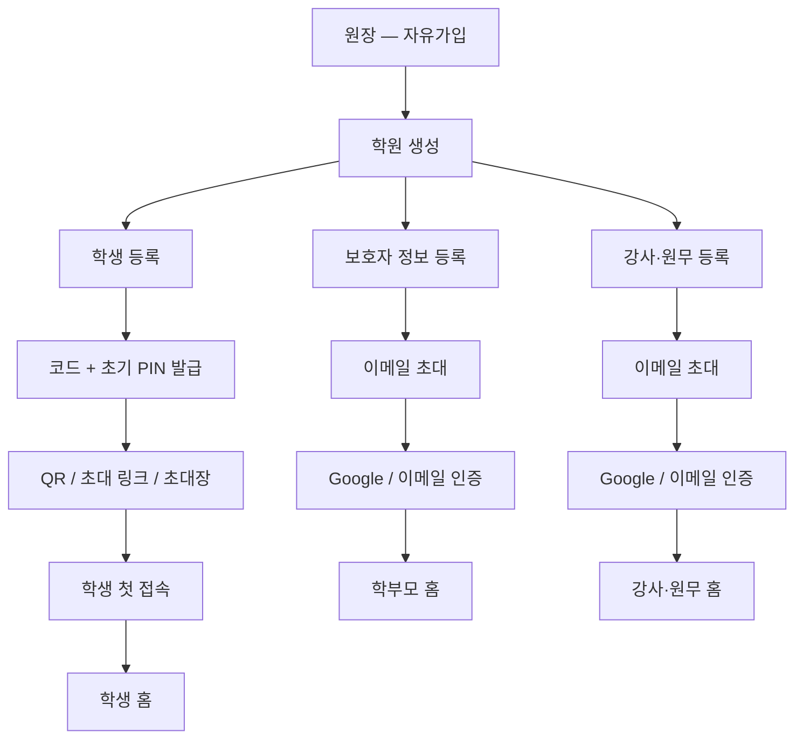
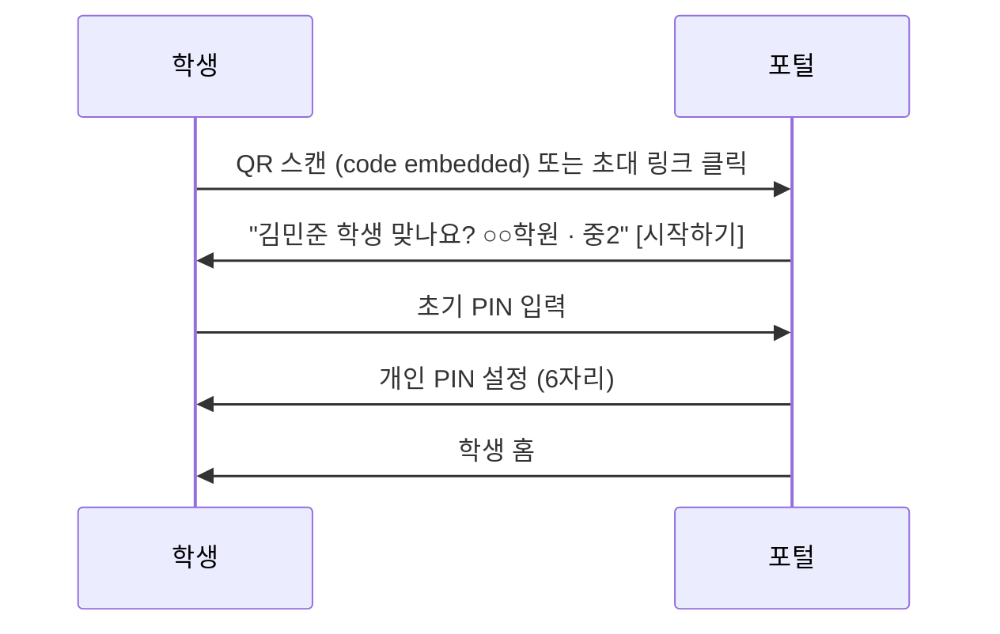

# EduFlow 초대 우선 온보딩 재설계 (Invite-First Onboarding)

> 작성일: 2026-07-09
> 상태: **구현 중** (Phase 1–3 앱 연동 완료, Phase 4·Resend 이메일 발송 예정)
> 범위: 가입·초대·로그인 Flow, 관련 데이터 모델. 운영 화면(학생/상담/수업) IA는 비범위.
> 관계 문서:
> - `USER_MODEL_ARCHITECTURE.md` §6–7 — 기존 추천안은 **자유가입 + 온보딩 중 학원 연결**이 기본. 본 문서는 이를 **초대 우선**으로 대체한다 (owner 제외).
> - `EDUFLOW_IA.md` §7, §11 — Auth IA·연결 IA. 본 문서 반영 시 §7.1/§7.2/§11 갱신 필요.
> - `academy_memberships`, `academy_invitations` (마이그레이션 038) — 이미 스키마는 존재하나 앱 코드가 아직 연결하지 않은 **휴면 테이블**. 본 설계의 기반으로 활성화한다.

---

## 0. 왜 바꾸는가

현재(`/signup` 자유가입 + `RolePicker` + `/join/[code]` + `PhoneSignupWizard`)는 **사용자가 먼저 계정을 만들고, 학원에 연결을 요청하고, 원장이 승인**하는 구조다. 이름·학교·학년·전화번호를 온보딩에서 다시 입력하고, 승인 대기 상태가 생기고, 100명 단위 학생을 한 명씩 승인해야 한다.

바꾸는 구조는 반대다. **학원이 먼저 사람을 등록**하고, 사용자는 **초대를 활성화하는 행동만** 한다. 원장만 예외적으로 자유가입한다(학원 자체가 없으므로 초대할 주체가 없다).

---

## 1. 핵심 원칙

| # | 원칙 |
|---|------|
| 1 | 원장만 자유가입. 학생·학부모·강사·원무는 **초대로만** 진입한다 |
| 2 | 학원이 이미 아는 정보(이름·학교·학년·이메일·보호자 정보)는 사용자에게 다시 묻지 않는다 |
| 3 | 학생은 이메일이 없다는 전제로 설계한다 → **코드 + PIN** |
| 4 | 학부모·강사·원무는 이메일이 있다는 전제로 설계한다 → **이메일 초대 + Google/이메일 인증** |
| 5 | 로그인 진입점은 2개로만 분기한다: **학생 로그인** / **학원·학부모 로그인** |
| 6 | 로그인 후 역할을 고르게 하지 않는다. **워크스페이스**(학원×역할 조합)가 2개 이상일 때만 전환 UI를 보여준다 |
| 7 | 기존 RLS·포털 아키텍처(`student_connections`, `is_academy_staff()` 등)는 그대로 재사용한다 — 바뀌는 것은 **계정이 만들어지는 시점과 방법**이지 접근 제어 모델이 아니다 |
| 8 | 초대를 수락하는 순간 `onboarding_complete = true`로 즉시 설정한다. 이름·전화번호·프로필 사진 등 **어떤 온보딩 스텝도 거치지 않는다** — 초대 수락 자체가 온보딩의 전부다 |

---

## 2. 전체 구조



원장 가입만 `Academy`가 없는 상태에서 시작한다. 나머지 세 화살표(`학생/학부모/강사 등록`)는 전부 **원장(또는 원무) 액션이 먼저** 발생해야 다음 단계가 존재한다 — 즉 신규 유저가 스스로 만들어낼 수 있는 화면이 없다.

---

## 3. 역할별 Invite Flow

### 3.1 원장 — 유일한 자유가입

변경 없음. 현재 `/signup` → `handle_new_user()` → `onboarding_complete=false` → `/onboarding` → `StepOwnerAcademy`(학원 생성) 그대로 유지.

### 3.2 학생 — 코드 + PIN (이메일 없음 전제)

**등록 (Staff):**

```
학생 등록 폼
  이름, 학교, 학년, 반
  보호자 이름 / 보호자 이메일  ← 학부모 초대(3.3)와 동시 입력

  → students INSERT
  → login_code 자동 발급 (신규 전역 고유 8자리 코드, 3.2.1 참고)
  → 초기 PIN 자동 발급 (4자리, 1회성)
  → QR / 초대 링크 / 초대장 생성
```

**전달 방법 (Staff 선택):**

| 방법 | 용도 |
|------|------|
| QR 보기 | 수업 시간에 화면으로 스캔 |
| 초대 링크 복사 | 카카오톡 등 메신저 전달 |
| 초대장 출력(반 단위 일괄) | 종이 배포 — 100명 단위 대응 |

**학생 첫 접속:**



**이후 로그인:**

| 상황 | 입력 |
|------|------|
| 같은 기기, 세션 유지 | 자동 로그인 (기존 세션) |
| 같은 기기, 재로그인 | 이름 표시 + 개인 PIN만 |
| 새 기기 | 학생 로그인 코드(8자리, `XXXX-XXXX`) + 개인 PIN |

#### 3.2.1 로그인 코드 강화 — 전역 고유 8자리

기존 `connection_code`(`EDU-` 고정 접두사 + 4자 + 2자리 숫자 체크섬)를 로그인 식별자로 재사용하려던 최초안은 폐기한다. `EDU-` 접두사는 엔트로피에 기여하지 않고, 뒷자리 2자리 숫자(00–99)는 사실상 100가지뿐이라 전체 키스페이스가 필요 이상으로 좁아진다.

대신 **신규 컬럼 `students.login_code`**를 둔다.

- 형식: `XXXX-XXXX` (8자, 모호한 문자 `0/O/1/I` 제외한 32자 알파벳)
- 생성: 접두사 없이 8자 전부를 무작위 채움 → 키스페이스 32⁸ ≈ 1.1×10¹²
- **전역 유일**(academy 단위가 아니라 전체 `students` 테이블에서 유일) — 로그인 시점에는 어느 학원 소속인지 모르는 상태에서 코드만으로 조회해야 하기 때문
- 기존 `students.connection_code`(레거시 학부모 연결용)와 `students.student_code`(학원 내부 관리번호)는 그대로 두고 용도를 겹치지 않게 분리한다. `connection_code`는 USER_MODEL_ARCHITECTURE.md §12.3 계획대로 계속 제거 대상으로 남는다.

#### 3.2.2 인증 메커니즘 — PIN을 비밀번호로 직접 노출하지 않는다

최초안은 `signInWithPassword({ email: 합성이메일, password: PIN })`을 클라이언트에서 직접 호출하는 구조였다. 이는 재검토 대상이다: **6자리 숫자 PIN은 경우의 수가 100만 개뿐**이고, Supabase의 기본 rate limit은 프로젝트/IP 단위이지 계정 단위 잠금이 아니어서, 특정 학생 계정을 노려 코드만 알면 오랜 시간에 걸쳐 무제한 시도가 가능하다.

그래서 **PIN을 `auth.users` 비밀번호로 쓰는 아이디어 자체는 유지**하되(Supabase Auth·RLS 재사용의 이점이 크다), 클라이언트가 GoTrue의 `signInWithPassword`를 직접 호출하지 못하게 막고 **서버 측 Edge Function 하나를 유일한 진입점**으로 둔다.

```
클라이언트 → Edge Function `student-login` (service role)
  1. login_code로 students 조회 — 존재하지 않아도 다음 단계를 "그대로" 진행한다(3.2.3)
  2. students.pin_locked_until 확인 → 잠금 중이면 거부 (일반 오류 메시지만 반환)
  3. 서버가 supabase.auth.signInWithPassword({ email: 합성이메일, password: PIN }) 대신 호출
  4. 실패 시: students.pin_fail_count += 1
     5회 실패 시 students.pin_locked_until = now() + 10분, pin_fail_count = 0
  5. 성공 시: pin_fail_count = 0, pin_locked_until = null
     → 세션(access_token/refresh_token)을 클라이언트에 반환
  6. 클라이언트는 supabase.auth.setSession()으로 세션만 주입 (비밀번호 검증은 절대 브라우저에서 하지 않음)
```

- `auth.users.email` = `{login_code}@student.eduflow.internal` (합성 이메일, 실제 발송 없음)
- `auth.users` password = 학생의 개인 PIN (Supabase 자체 해싱에 위임)
- Supabase 기본 비밀번호 최소 길이(6자) 때문에 **개인 PIN은 6자리**로 통일한다. 초기 PIN(스태프가 부여하는 임시값, 4자리)은 최초 로그인 직후 6자리 개인 PIN으로 강제 교체한다 (`students.pin_must_reset = true`).
- 이렇게 하면 `users.role='student'`, `student_connections` 연결, RLS 전부 기존과 동일하게 동작한다. 바뀌는 건 회원가입 폼이 아니라 **Auth 계정을 누가·언제 만드는지, 그리고 로그인 시도를 누가 통제하는지**뿐이다.

#### 3.2.3 `student-login`의 보안 규칙 (계정 단위 잠금만으로는 부족)

계정 단위 잠금(`pin_fail_count`/`pin_locked_until`)은 "코드 하나를 계속 찍는" 공격만 막는다. 다음 세 가지를 함께 강제한다.

| 규칙 | 이유 |
|---|---|
| **IP 단위 요청 제한** (예: 동일 IP 1분당 N회) | 계정 단위 잠금만 있으면 공격자가 코드를 바꿔가며 넓게 훑는(credential stuffing) 시도를 막을 수 없다. Edge Function 앞단 또는 배포 플랫폼의 rate limit으로 이중 방어한다 |
| **코드 존재 여부를 노출하지 않는다** | "코드 없음"과 "PIN 틀림"을 다른 오류로 보여주면 존재하는 학생 코드를 스캔해 찾아낼 수 있다(계정 열거). `login_code`가 없어도 있는 것처럼 동일한 지연·동일한 오류 문구("코드 또는 PIN이 올바르지 않습니다")로 응답한다 |
| **PIN 평문 무로깅** | Edge Function 로그, 에러 리포팅(Sentry 등), 감사 로그 어디에도 PIN 원문이 남으면 안 된다. 요청 바디를 로깅할 때 `pin` 필드는 마스킹하거나 아예 로그 대상에서 제외한다 |

이 설계는 "코드+PIN 검증은 반드시 서버가 세션을 발급하는 구조"를 처음부터 채택한 것이다 — 클라이언트가 직접 `signInWithPassword`를 호출하는 경로는 아예 두지 않는다.

### 3.3 학부모 — 이메일 초대

**등록 (Staff):** 학생 등록 폼에 보호자 이름/이메일 포함 (3.2와 동시). 이 시점에 바로 `parents` CRM 레코드와 `parent_student_links`(관계)가 만들어진다 — **초대는 나중에 그 레코드에 로그인 계정을 붙이는 절차일 뿐**, 관계 데이터 자체는 등록 시점에 이미 확정된다.

```
학생 등록 제출 시:
  students INSERT
  parents UPSERT (academy_id, name=보호자 이름, email=보호자 이메일, user_id=null)
  parent_student_links INSERT (parent_id, student_id, relationship, is_primary=true)
```

상태는 `미초대 → 초대 대기 → 연결 완료` 3단계로 목록에 표시하고(= `parents.user_id is null` / `academy_invitations.status='active'` / `'used'`), 일괄 초대를 지원한다(`미초대 54명 모두 초대`).

**초대 발송 시:**

```
academy_invitations INSERT
  role = 'parent'
  academy_id, invited_by
  token_hash = 발급한 원문 토큰의 SHA-256 해시 (3.6 참고, 원문은 DB에 남기지 않음)
  target_parent_id (parents.id, 신규 컬럼 — 매칭의 실제 기준)
  target_student_id (표시용 — "OO 학생의 학부모" 메시지에 사용)
  target_email, invited_name (신규 컬럼)
  expires_at = now() + interval '7 days'  (오픈 이슈 결정, 6절 참고)
→ 이메일 발송: /invite/[원문 토큰]  (원문 토큰은 이메일 링크에만 존재)
```

**학부모 첫 접속:**

```
/invite/[token] 접속
  → 원문 토큰을 해시해 academy_invitations.token_hash로 조회 → 미사용·미만료 확인
  → "김민준 학생의 학부모 계정으로 초대되었습니다"
  → [Google로 계속하기] / [이메일로 계속하기]
  → 인증 완료 후, accept_academy_invitation(token, ...) 내부에서:
      1. 인증된 이메일 == target_email 검증 (대소문자 무시) — 불일치 시 전체 거부 (3.5 참고)
      2. parents UPDATE SET user_id = auth.uid() WHERE id = target_parent_id
      3. student_connections INSERT (student_id=target_student_id, user_id=auth.uid(), relationship = parent_student_links에서 조회)
      4. academy_memberships INSERT (role='parent', status='active')
      5. users.onboarding_complete = true  (원칙 8 — 온보딩 스텝 없이 즉시 완료 처리)
      6. academy_invitations.status = 'used'
  → "김민준 학생과 연결되었습니다" [시작하기] → /parent
```

이름·전화번호·자녀 이름·학교·학년을 묻는 단계 자체를 없앤다 — 이미 `students`/`parents`에 있다. 온보딩 `StepParentConnect`(코드 입력 후 승인 대기)는 이 플로우에서 제거된다: 초대 링크 자체가 이미 "승인된" 상태이므로 `student_connection_requests`(대기열)를 거치지 않고 바로 `student_connections`에 INSERT한다.

`target_parent_id`를 매칭 기준으로 쓰는 이유: 이메일 대소문자·오타 차이로 upsert가 어긋날 위험이 없고, `parents` 레코드가 이미 등록 시점에 존재하므로 초대 수락은 "새로 만드는" 동작이 아니라 "기존 레코드에 `user_id`를 채우는" 단순 UPDATE로 끝난다. 같은 학부모가 자녀 여러 명(형제자매)을 등록했다면 `target_email`이 같은 두 번째 초대부터는 기존 `auth.users` 계정으로 로그인만 하면 되고, `accept_academy_invitation`은 이미 멤버십이 있어도 `student_connections`만 추가하면 된다(멱등 처리).

### 3.4 강사·원무 — 이메일 초대

```
강사 등록 (Staff)
  이름, 이메일, 권한(teacher | desk)
  → academy_invitations INSERT (role='teacher'|'desk', target_email, invited_name, token_hash)
  → 이메일 발송: /invite/[원문 토큰]

강사 첫 접속
  /invite/[token] → "이서연 선생님, 강사로 초대되었습니다"
  → Google/이메일 인증
  → accept_academy_invitation(token, ...) 내부에서:
      1. 인증된 이메일 == target_email 검증 — 불일치 시 거부 (3.5 참고)
      2. academy_memberships INSERT (role, status='active')
      3. staff_profiles 자동 생성 (기존 트리거 재사용)
      4. users.onboarding_complete = true (원칙 8)
      5. academy_invitations.status = 'used'
  → "○○학원에 합류했습니다" [시작하기] → /dashboard
```

담당 반은 강사가 고르지 않고 Staff가 `class_teachers`에 지정한다 (기존 구조 그대로).

### 3.5 초대 이메일 = 인증 이메일 일치 검증

초대 링크는 특정 이메일 주소 앞으로 발급된다. 인증 수단과 무관하게 **실제로 로그인한 사람이 그 이메일의 소유자인지**를 서버에서 강제해야 한다 — 그렇지 않으면 초대 링크가 유출됐을 때 아무나 다른 학생의 학부모로, 혹은 다른 사람의 강사 계정으로 연결될 수 있다. 3.3·3.4의 `accept_academy_invitation()` 호출이 공통으로 따르는 규칙이다.

| 인증 수단 | 일치 보장 방식 |
|---|---|
| 이메일 매직링크 / OTP | `target_email`로만 발송되므로 구조적으로 일치 (다만 링크를 제3자에게 전달하면 우회 가능 — 링크 자체를 1회용 토큰으로 소진 처리해 완화) |
| Google 로그인 | OAuth가 반환한 이메일과 `target_email`을 `accept_academy_invitation()` 내부에서 서버 측으로 비교. 불일치 시 멤버십·연결 생성을 거부하고 "이 초대는 parent@gmail.com 전용입니다" 안내 후 로그아웃 → 재인증 유도 |

이 검증은 **클라이언트 조건문이 아니라 RPC 내부(`auth.jwt() ->> 'email'` 비교)에서 강제**한다. 클라이언트 검증만으로는 요청을 조작해 우회할 수 있다.

### 3.6 데이터 모델 변경

**재사용 (변경 없음):**

| 테이블/함수 | 역할 |
|---|---|
| `academies`, `students`, `parents`, `parent_student_links` | CRM 레코드 |
| `student_connections` | 포털 접근 권한의 단일 truth (RLS 기준) — 그대로 |
| `academy_memberships` | 역할·학원 멤버십 (038에서 이미 생성, 지금부터 **primary**로 승격) |
| `is_academy_staff()`, `user_connected_to_student()` 등 기존 RLS 헬퍼 | 변경 없음 |
| `students.connection_code` | 기존 계획대로 계속 deprecated (USER_MODEL_ARCHITECTURE.md §12.3) — 로그인 용도로 재활용하지 않는다 |

**신규/변경:**

```sql
-- students: 로그인 코드 + PIN 인증/잠금
alter table public.students
  add column if not exists login_code text,          -- 전역 고유 8자리, XXXX-XXXX (3.2.1)
  add column if not exists pin_must_reset boolean not null default true,
  add column if not exists pin_fail_count int not null default 0,
  add column if not exists pin_locked_until timestamptz;
  -- 실제 PIN 해시는 auth.users(password)에 위임 — students에는 PIN 자체를 저장하지 않는다

create unique index if not exists students_login_code_key
  on public.students (login_code);

-- academy_invitations: 대상·수신자 정보 보강 + 토큰 해시화 (038은 role/token 평문만 있었음)
alter table public.academy_invitations
  add column if not exists token_hash text,
  add column if not exists target_email text,
  add column if not exists target_student_id uuid references public.students(id) on delete cascade,
  add column if not exists target_parent_id uuid references public.parents(id) on delete cascade,
  add column if not exists invited_name text;
  -- expires_at은 038에 이미 존재 (nullable) — 신규 발급 시 now() + interval '7 days'로 채운다 (6절)

create unique index if not exists academy_invitations_token_hash_key
  on public.academy_invitations (token_hash);

-- 원문 토큰은 발급 시 이메일 링크에만 실려 나가고 DB에는 해시만 남는다.
-- token_hash = encode(digest(원문_토큰, 'sha256'), 'hex')
-- academy_invitations는 아직 앱 코드가 참조하지 않는 휴면 테이블이므로 평문 컬럼은 그대로 제거한다.
alter table public.academy_invitations drop column if exists token;
```

**신규 RPC / Edge Function:**

| 이름 | 형태 | 역할 |
|------|------|------|
| `create_student_invite(student_id)` | RPC | `login_code` 발급 + 초기 PIN 생성, staff만 호출 가능 |
| `student-login` | Edge Function (service role) | `{login_code, pin}` 수신 → IP 제한·계정 잠금 확인 → 서버 측에서만 `signInWithPassword` 호출 → 실패 카운트/잠금 갱신 → 성공 시 세션 반환 (3.2.2–3.2.3) |
| `set_student_personal_pin(new_pin)` | RPC | 최초 로그인 시 6자리 개인 PIN으로 교체, `pin_must_reset=false` |
| `reset_student_pin(student_id)` | RPC | **Staff 전용.** 새 임시 PIN(4자리) 발급 + `pin_must_reset=true`, 잠금·실패 카운트 초기화 (6절 결정) |
| `accept_academy_invitation(token)` | RPC | `token_hash` 조회 → 만료 확인 → `auth.jwt() ->> 'email'`이 `target_email`과 일치하는지 검증(3.5) → `parents.user_id` UPDATE + `student_connections`/`academy_memberships` 생성 → `onboarding_complete=true` → `status='used'` |
| `resend_academy_invitation(invitation_id)` | RPC | Staff 전용. 기존 초대를 `revoked` 처리하고 새 `token_hash`·`expires_at`으로 재발급 + 이메일 재발송 (6절 결정) |
| `send_bulk_parent_invites(student_ids[])` | RPC | 미초대 보호자 일괄 초대 |

**제거 대상 (Phase 4, 5절 참고):**

| 대상 | 사유 |
|------|------|
| `/signup` (owner 제외 역할), `RolePicker`(student/parent/teacher 옵션) | 자유가입 경로 폐기 |
| `/join/[code]`, `PhoneSignupWizard` | 코드+전화 자유가입 경로 폐기 → 초대 기반으로 대체 |
| `StepParentConnect`, `StepStudentConnect`, `StepTeacherJoin` (온보딩) | 초대 링크가 이미 연결을 포함하므로 온보딩에서 "연결 대기" 스텝 불필요 |
| `student_connection_requests` 대기열 흐름 | 신규 유입은 초대가 곧 승인이므로 미사용. 레거시 데이터 조회용으로만 테이블 유지 |

---

## 4. 로그인 페이지 재설계

```
┌─────────────────────────────┐
│ 학생 로그인                  │  → 학생 코드 + PIN
│ 학원 · 학부모 로그인         │  → Google 또는 이메일
└─────────────────────────────┘
```

### 4.1 워크스페이스 단위 선택 (role 단위가 아니다)

역할(role) 하나만으로는 실제 상황을 표현하지 못한다 — 한 사람이 A학원에서는 강사, B학원에서는 학부모일 수도 있고, 같은 학원에서 강사+학부모를 겸할 수도 있다. 그래서 선택 단위는 **워크스페이스 = `academy_memberships` 한 행 (academy_id + role)**으로 정의한다.

```
academy_memberships (user_id = 나)
  ├─ (academy_id=A, role='teacher', status='active')  → 워크스페이스 1
  └─ (academy_id=B, role='parent',  status='active')  → 워크스페이스 2
```

- 로그인 시 활성 `academy_memberships` 행이 **1개면** 즉시 그 워크스페이스 홈으로 이동한다 (지금과 동일한 경험).
- **2개 이상이면** `/choose-workspace`에서 role 이름만이 아니라 **"OO학원 · 강사" / "△△학원 · 학부모"처럼 학원명+역할을 함께** 카드로 보여준다. role만 보여주면 어느 학원인지 구분이 안 된다.
- 선택한 워크스페이스는 `academy_memberships.id`를 활성 컨텍스트로 세션/쿠키에 저장한다. `postAuthDestination()`(`lib/authRedirectPolicy.ts`)과 RLS 컨텍스트(`current_academy_id()` 등)는 이 활성 membership 행을 기준으로 판단하도록 바뀐다 — "role을 바꾼다"가 아니라 "워크스페이스를 바꾼다"는 개념이다.
- 상단 워크스페이스 스위처(향후)도 같은 모델 위에서 동작 — 목록에 뜨는 항목은 항상 (학원명, 역할) 쌍이다.

### 4.2 화면 인벤토리

| 화면 | 경로 | 비고 |
|------|------|------|
| 학생 로그인 | `/login/student` | 코드 + PIN → `student-login` Edge Function 호출, 신규 |
| 학원·학부모 로그인 | `/login` | 기존 `(auth)/login` 유지 (Google/이메일) |
| 학생 첫 접속(초대 활성화) | `/student-invite/[login_code]` | QR 대상, 신규 |
| 학부모·강사·원무 초대 활성화 | `/invite/[token]` | 신규. URL의 원문 토큰을 해시해 `academy_invitations.token_hash`로 조회 |
| 워크스페이스 선택(멤버십 2개 이상일 때만) | `/choose-workspace` | 기존 `/auth/choose-role`을 대체 (용도가 다름 — OAuth 최초 가입용이 아니라 다중 워크스페이스 전환용) |

---

## 5. Migration Plan

| Phase | 내용 |
|-------|------|
| **Phase 1** | `academy_memberships`를 실제 RLS/역할 판정의 primary로 전환 (USER_MODEL_ARCHITECTURE.md §13 Phase 2 완료), `postAuthDestination()`을 워크스페이스(membership 행) 기준으로 재작성 (4.1). 본 설계는 이 위에서만 성립한다 |
| **Phase 2** | `academy_invitations` 컬럼 확장(`token_hash`, `target_parent_id`/`target_student_id`/`target_email`) + 학생 등록 시 `parents`/`parent_student_links` 즉시 생성 + `accept_academy_invitation` RPC(이메일 일치 검증 + `parents.user_id` UPDATE 포함) + `/invite/[token]` 화면 (학부모·강사·원무 초대 플로우) |
| **Phase 3** | 학생 코드+PIN 로그인: `students.login_code`/`pin_fail_count`/`pin_locked_until` 추가, `create_student_invite` RPC, `student-login` Edge Function, `/login/student`, `/student-invite/[login_code]` |
| **Phase 4** | 자유가입 경로 폐기: `/signup`(owner만 남김), `/join/[code]`, `PhoneSignupWizard`, `StepParentConnect`/`StepStudentConnect`/`StepTeacherJoin` 제거. 학생 등록 화면에 QR/초대 UI 통합 |

Phase 4 전까지는 기존 자유가입 경로와 신규 초대 경로가 공존한다 — 기존 학원·사용자 데이터는 그대로 두고, 신규 등록 플로우만 초대 우선으로 전환한다.

---

## 6. 결정 사항 (기존 오픈 이슈)

| 이슈 | 결정 |
|---|---|
| 학생 개인 PIN 분실 시 재설정 | **Staff만 재발급**한다. 보호자가 직접 요청하는 경로는 두지 않는다 — `reset_student_pin(student_id)`는 staff 권한 체크(`is_academy_staff()`)를 통과해야 호출된다. 학생/보호자는 "PIN을 잊었어요 → 학원에 문의하세요" 안내만 본다 |
| 초대 링크 만료 | `academy_invitations.expires_at = created_at + 7일`로 고정 발급한다. `accept_academy_invitation`은 `now() > expires_at`이면 `status`를 그대로 두고 거부만 한다(자동 만료 처리는 스케줄 잡으로 별도, 또는 조회 시점 lazy check로 충분) |
| 만료 후 처리 | 원장·원무 화면에서 "다시 초대" 액션 제공 → `resend_academy_invitation(invitation_id)` 호출. 기존 토큰은 즉시 `revoked` 처리해 만료된 링크가 뒤늦게 눌려도 동작하지 않게 한다 |
| 이메일 발송 인프라 | **Resend**를 기본으로 채택한다. 현재 프로젝트에 트랜잭션 이메일 연동이 없으므로 Phase 2 착수 시 Resend API 키·발신 도메인(SPF/DKIM) 설정이 선행 작업이다 |
