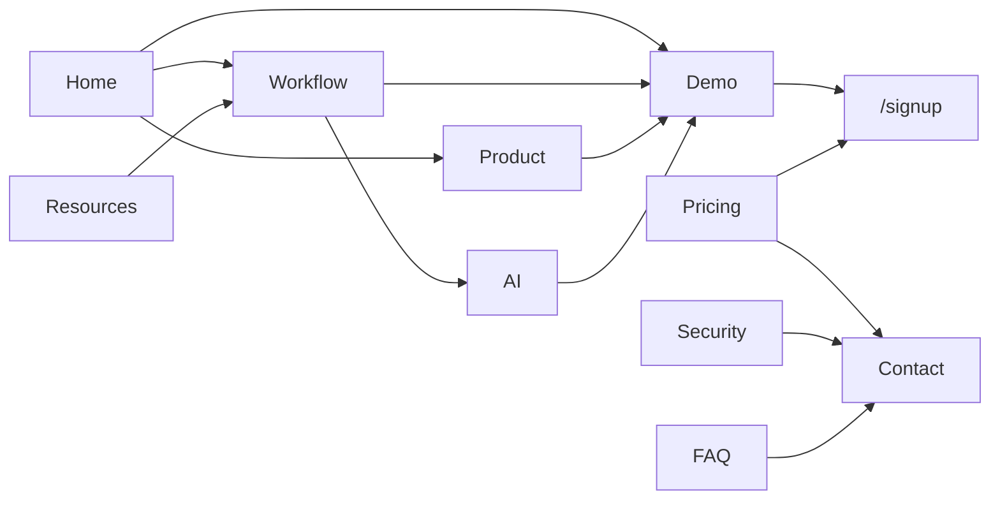

# EduFlow 웹사이트 Information Architecture

> **정체성:** EduFlow는 학원 ERP가 아닌, **학생 기록이 상담 준비가 되는 AI 상담 운영 시스템**입니다.

## 방문자가 이해해야 할 4가지

| # | 질문 | 주로 답하는 페이지 |
|---|------|-------------------|
| 1 | 이 서비스가 무엇인가? | Home, About |
| 2 | 왜 기존 ERP와 다른가? | Workflow, AI |
| 3 | 상담·재등록을 어떻게 돕는가? | Product, Workflow, Demo |
| 4 | 믿고 체험·문의할 수 있는가? | Customers, Security, Pricing, Contact |

**모든 섹션 판단 기준:** *「이 내용이 상담과 재등록을 더 잘하게 만든다는 확신을 주는가?」*

---

## 라우팅 맵

```
/                    Home          브랜드 입구
/product             Product       제품·화면 중심
/workflow            Workflow      핵심 차별점 (스토리)
/ai                  AI            AI 결과 중심
/demo                Demo          로그인 없는 체험
/pricing             Pricing       요금·플랜
/customers           Customers     신뢰·파일럿
/resources           Resources     운영 콘텐츠
/security            Security      개인정보·권한
/about               About         철학·비전
/contact             Contact       도입 문의
/faq                 FAQ           구매 전 질문
/privacy             Legal         개인정보처리방침
/terms               Legal         이용약관
```

앱(로그인 후) 라우트는 `(app)/` 그룹 유지. 마케팅은 `(marketing)/` 그룹.

---

## 페이지별 상세 IA

### 1. Home `/`

**역할:** 첫인상 · 5초 내 핵심 메시지  
**목표:** 「학생 기록 → AI 상담 준비」 즉시 이해

| 섹션 | 목적 | CTA |
|------|------|-----|
| Hero | 한 줄 가치 제안 + 제품 목업 | 무료 체험 / 데모 보기 |
| Problem (3) | 상담 준비·위험 신호·재등록 타이밍 | — |
| AI Preview (3) | Summary / Risk / Counseling Card 맛보기 | AI 페이지로 |
| Product Teaser | 대시보드 스크린 1장 크게 | Product 페이지로 |
| Explore | Workflow · Demo · Pricing 링크 | 각 페이지 |

**넣지 않음:** 전체 기능, 가격표, FAQ, 긴 Workflow

---

### 2. Product `/product`

**역할:** 실제 사용 장면 중심 제품 설명

| 섹션 | 장면 중심 메시지 |
|------|------------------|
| Dashboard | 오늘 상담·위험 학생·미마감 수업 |
| Student Hub | 학생별 기록·AI 분석·재등록 맥락 |
| Today Lesson | 1분 안에 출결·숙제·점수·메모 |
| Counseling | 상담 전 카드·talking points |
| Parent Report | 상담 결과 학부모 전달 |
| Re-registration | 위험도·상담·전환 기록 연결 |
| Teacher Dashboard | 강사 오늘 수업·마감 큐 |

**CTA:** Demo · Free Trial

---

### 3. Workflow `/workflow` ⭐ 핵심

**역할:** ERP 기능 나열 ❌ → **하나의 학원 운영 스토리**

```
오늘 수업
  ↓ 출결/숙제/점수/메모
학생 변화 기록
  ↓
AI 분석
  ↓
위험 학생 감지
  ↓
상담 준비
  ↓
AI 상담 카드
  ↓
학부모 상담·리포트
  ↓
재등록 관리
```

**메시지:** 기록 → 상담 → 재등록  
**CTA:** Demo에서 흐름 체험 · Contact

---

### 4. AI `/ai`

**역할:** 기술명 ❌ → **사용자가 얻는 결과**

| 기능 | 결과 중심 설명 |
|------|----------------|
| AI Student Summary | 상담 전 변화·포인트 정리 |
| Risk Snapshot | 놓치기 쉬운 이탈 신호 |
| AI Counseling Card | 학부모/학생별 talking points |
| AI Parent Report | 이해하기 쉬운 주간 리포트 |
| Retention Insight | 재등록 타이밍·근거 |

**CTA:** Demo · Workflow

---

### 5. Demo `/demo`

**역할:** 계정 없이 핵심 경험

| 블록 | 행동 |
|------|------|
| Demo Academy 소개 | 맥락 설정 |
| Dashboard 데모 | 인터랙티브 목업 |
| Student Hub 데모 | 목업 |
| AI 상담 카드 데모 | 목업 |
| Parent Report 데모 | 목업 |
| Full Trial | /signup · /auth (데모 계정) |

---

### 6. Pricing `/pricing`

**역할:** 원장이 30초 내 플랜 판단

| Starter | Pro ⭐ | Enterprise |
|---------|--------|------------|
| ~50명 | ~200명 | 다지점·맞춤 |

비교표 · 14일 무료 · Contact

---

### 7. Customers `/customers`

**역할:** 신뢰 (과장 수치 금지)

- 파일럿 준비 중 · 원장 인터뷰 기반 개선
- Before/After (정성)
- 상담 준비·재등록 관련 피드백 인용

---

### 8. Resources `/resources`

- 학원 상담 운영 가이드
- 재등록 관리 팁
- AI 상담 활용법
- 업데이트 노트

---

### 9. Security `/security`

- 개인정보 · 권한 · 학원별 데이터 분리
- AI 데이터 사용 원칙 · 백업 · 접근 제어

**질문에 답:** 학생 정보를 맡겨도 되는가?

---

### 10. About `/about`

- ERP가 아닌 이유
- 흩어진 기록 · 반복 상담 준비 · 재등록 놓침 해결
- 원장이 학생을 더 잘 이해하도록

---

### 11. Contact `/contact`

- 도입 문의 폼 · 데모 신청 · 이메일 · 응답 SLA

---

### 12. FAQ `/faq`

- 엑셀 이전 · ERP 병행 · AI 데이터 · 보안 · 권한 · 체험 · 소형 학원

---

## Navigation

**Header:** Product · Workflow · AI · Pricing · Resources · Contact  
**Header 우측:** Login · Free Trial

**Footer 4열:** Product · Company · Resources · Legal

---

## 사용자 이동 흐름



**Primary conversion:** Home/Demo/Pricing → Free Trial (`/signup`)  
**Secondary:** Workflow/Product → Demo → Contact

---

## 디자인 원칙

| 사용 | 색 |
|------|-----|
| Base | 흰색 · 웜 그레이 |
| Text | 차콜 (stone-900) |
| Accent | 에메랄드/틸 (CTA, AI, 긍정) |
| Risk | 앰버/로즈 (위험 신호만) |

- 파란색 AI SaaS 템플릿 회피
- 페이지마다 Hero–본문–CTA 리듬 차별
- 스크린샷·목업 크게, 카드 6개 나열 지양

---

## 구현 매핑

| 경로 | 컴포넌트 |
|------|----------|
| `(marketing)/layout.tsx` | MarketingShell |
| `(marketing)/page.tsx` | HomePageContent |
| `(marketing)/*/page.tsx` | 각 *PageContent |

설정 단일 출처: `lib/marketing/siteStructure.ts`
